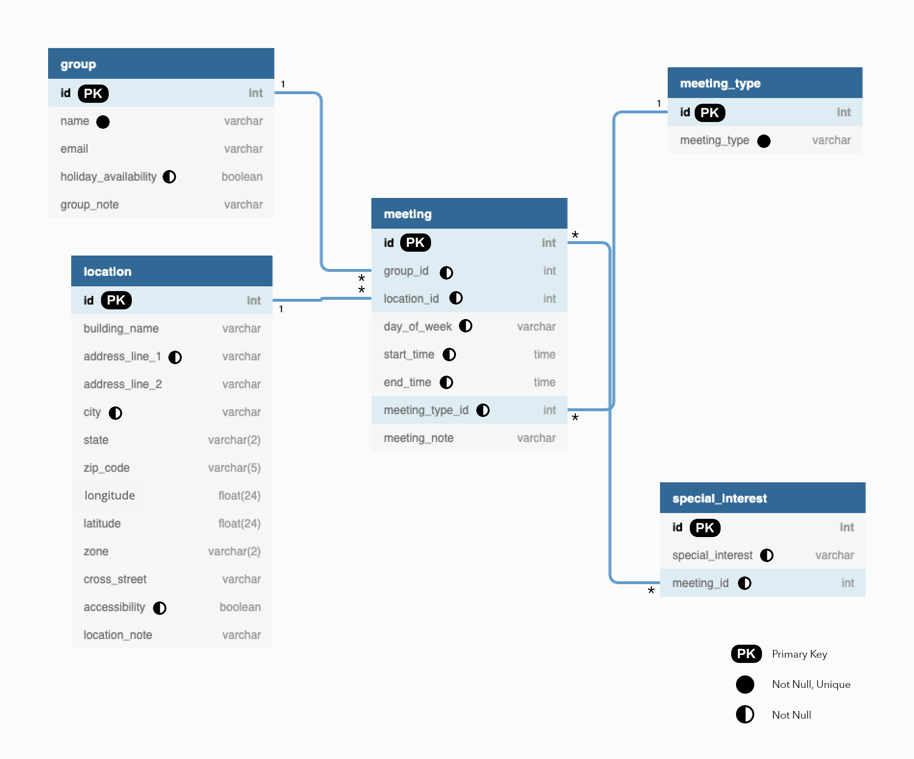

### Summary
Create a schema design for a SQL database using the AA meeting data. 
##
### Assignment Details
Populate dummy data tables with ALL the data from the first three rows of the AA zone (01) and save to an [Excel file](https://github.com/muonius/msdv-data-structures/blob/master/week04_01/dummy_data.xlsx). Draw and upload a [database schema diagram](https://github.com/muonius/msdv-data-structures/blob/master/week04_01/sql_diagram.png). 
##
### Process
###
**Decisions**: 

1. The AA Meeting data is relatively static and small scale. However, I still chose to normalize the data to reduce redundency and most importantly preserve data integrity as we have observed the original data has huge data integrity issues. 
2. The data structure that comes out of the database should be in JSON format that allows nested objects and arrays. The JSON format provides flexiblity in multi-dimensional user search and filtering. One example would be - one meeting can be tagged with an array of special interests [`young`,`queer`] or [`senior`,`korean-speaking`,`cancer survivor`]. If the data structure is in table format, it will force the meeting to have only one special interest option or surface a meeting multiple times just because it has multiple special interests. 
3. In terms of the hierachy, I think the schema structure resembles a star schema. With table `meeting` in the center serving as a fact-like table, and other tables linked to it as dimentional tables.
###
**Schema Design**:

One thing I'm not entirely sure is the many-to-many relationship between `meeting` table and `special_interest` table. To represent this relationship in a SQL database, one has to create redundency in the `special_interest` table where multiple special interests can be associated with one `meeting_id` and one `meeting_id` can be associated with multiple special interests. I almost want the `special_interest` value to exist in an array format and wonder if a NoSQL database makes more sense here. 

##  
### Reflections
###
I have some interesting revelations while working on this assignment. 

* My previous role in analytics heavily influenced my earlier thought process that I mistook a data warehouse for a database. In analytics, we want a denormalized data structure but that's different from how data is stored operation wise.
I found this [article](https://panoply.io/data-warehouse-guide/the-difference-between-a-database-and-a-data-warehouse/) about the difference between database and data warehouse particularly helpful in my decision making.

* Also dug a bit deeper into the different degrees of normalization and trade-offs and I found [wikipedia's explanation](https://en.wikipedia.org/wiki/Database_normalization) to be one of the most comprehensive articles on `normal forms`.
##  
### References
- [https://www.conceptatech.com/blog/best-practices-how-to-design-a-database](https://www.conceptatech.com/blog/best-practices-how-to-design-a-database)
- [https://www.conceptatech.com/blog/nosql-vs-sql-which-is-right-for-your-project](https://www.conceptatech.com/blog/nosql-vs-sql-which-is-right-for-your-project)
- [https://panoply.io/data-warehouse-guide/the-difference-between-a-database-and-a-data-warehouse/](https://panoply.io/data-warehouse-guide/the-difference-between-a-database-and-a-data-warehouse/)
- [https://francisjohnpicaso.wordpress.com/2018/12/09/star-schema-vs-flat-table-for-reporting-a-comparative-study/](https://francisjohnpicaso.wordpress.com/2018/12/09/star-schema-vs-flat-table-for-reporting-a-comparative-study/)

