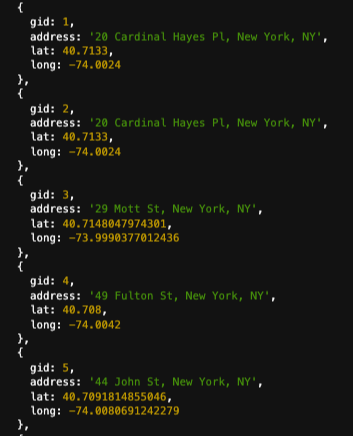
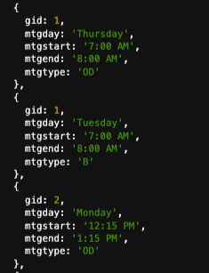

### Summary
Continue to scrape data from AA website and write data into Amazon RDS PostgreSQL database. 
##
### Assignment Details
- Set up Amazon RDS PostgreSQL database, re-install all dependencies in new Cloud9 environment. (`env`,`async`,`got`,`pg`,`fs`,`querystring`,`cheerio`)
- Scrape and prepare tables in Node.js.
- Create tables in PostgreSQL, insert data and check if data has been written into the database correctly.  

##
### Process
###
**Step 1**: Scrape more data and create tables for PostgreSQL database. 

- In [week04a_scrape_tables_v2.js](https://github.com/muonius/msdv-data-structures/blob/master/week04_02/week04a_scrape_tables_v2.js), I created a new table `flatmeetings` that lists out basic individual meeting information. Each meeting is assigned with a `gid` (group id).

    gid | mtgday | mtgstart | mtgend | mtgtype
    ----|--------|----------| -------|---------  
    1 | 'Wednesday' | '8:30 PM' | '9:30 PM' | 'C'

- Initially, I built the table in nested JSON format. I later decided to flatten it for easy writing into PostgreSQL.

- I made small modifications to [week03.js](https://github.com/muonius/msdv-data-structures/blob/master/week03/week03.js) that outputs an `addresses` table. Each address is also assigned with a `gid`. Later, I will use `gid` to join `flatmeetings` with `addresses`.
###
**Step 2**: Create empty PostgreSQL tables

In [week04b_create_sqltables.js](https://github.com/muonius/msdv-data-structures/blob/master/week04_02/week04b_create_sqltables.js), I followed the starter code and created two empty PostgreSQL tables `aalocations` and `meetings`.
###
**Step 3**: Insert data into PostgreSQL

In [week04c_fill_sqltables.js](https://github.com/muonius/msdv-data-structures/blob/master/week04_02/week04c_fill_sqltables.js), I followed the starter code and write into PostgreSQL tables `aalocations` and `meetings` using the two JSON files I created in Step 1.
###
**Step 4**: Test data input in PostgreSQL

In [week04d_check_work.js](https://github.com/muonius/msdv-data-structures/blob/master/week04_02/week04d_check_work.js), I followed the starter code and print out the two PostgreSQL tables. They looked about right. Snippets of query output attached below.

table `aalocations`|table `meetings`
----------------------|--------------------
|

### Reflections
###
I realized that I should probably have constructed the new `flatmeeting` using a class template where I can define `mtgstart` and `mtgend` as numeric values vs strings. I will modify my code and make changes accordingly next time. 
I gained a deeper understanding of `forEach()` and `map()` methods in iterating through nested arrays. 
I wonder if I can write a nested array into PostgreSQL and if the syntax will be vastly different. 
