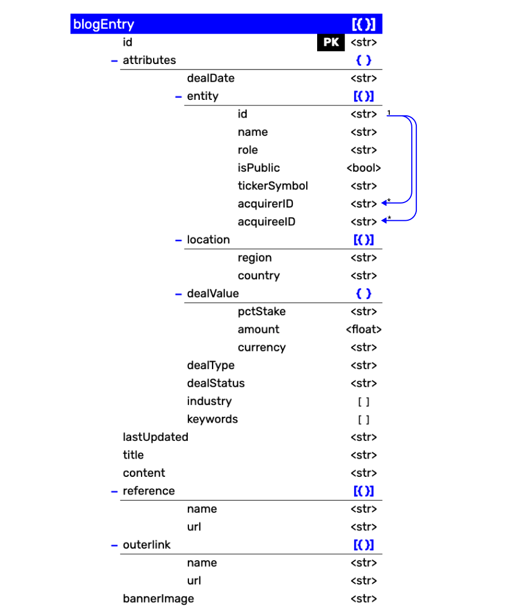

### Summary
Create a data model for a NoSQL database using a source of semi-structured, qualitative data of your choice. 
##
### Assignment Details
I decided to use this assignment to lay the foundation of an external collab project I'm working with [The Fashion Law](https://thefashionlaw.com/). We are experimenting coverting [this running list of fashion investments](https://thefashionlaw.com/a-running-timeline-of-fashion-and-luxury-mergers-acquisitions/) into a more reader-friendly format with the ability to search, filter and aggregate. I thought this running list of content is a perfect example of the semi-structured qualitative data.

Draw and upload the [data model diagram](https://github.com/meanmodemoda/msdv-data-structures/blob/master/week05/nosql_diagram.png), and three Word dummy entries.

[Dummy Entry 1](https://github.com/meanmodemoda/msdv-data-structures/blob/master/week05/dummy_entry_01.docx) | [Dummy Entry 2](https://github.com/meanmodemoda/msdv-data-structures/blob/master/week05/dummy_entry_02.docx) | [Dummy Entry 3](https://github.com/meanmodemoda/msdv-data-structures/blob/master/week05/dummy_entry_03.docx)

### Reference Output Format
[Parsons MSDV Thesis](https://parsons.nyc/thesis/#/)
[Triennale Milano Exhibit Digital Archive](https://triennale.org/archivi)

##
### Process
###
**Decisions**: 

1. I chose to denormalize the data given the nature of the NoSQL database, however, I also tried to reduce redundency within the JSON data model. For instance, the `attributes` object resembles a table format and I also included recursive relationship for company ids.
2. The data structure that comes out of the database should be in JSON format that allows nested objects and arrays. The `attributes` object is a skeloton of the unstructured, text based `content` that allows multivariate filtering and aggregation. 
3. The data model is multi-layered to retain its logical structure.
###
**Data Model Design**:

##  
### Reflections
Upon research, I think [hackolade](https://hackolade.com/) is a great resource for NoSQL database design. However, I don't like its diagram structure, which still seems overly complicated and I decided to draw a simplier format but leverage its tree-structure/folder-like concept.

##  
### References
- [https://hackolade.com/help/DynamoDB.html](https://hackolade.com/help/DynamoDB.html)

- [https://docs.aws.amazon.com/amazondynamodb/latest/developerguide/SampleData.CreateTables.html](https://docs.aws.amazon.com/amazondynamodb/latest/developerguide/SampleData.CreateTables.html)

- [https://hackolade.com/blog/the-tao-of-nosql-data-modeling.html](https://hackolade.com/blog/the-tao-of-nosql-data-modeling.html)

- [https://www.dataversity.net/how-to-design-schema-for-your-nosql-database/](https://www.dataversity.net/how-to-design-schema-for-your-nosql-database/)