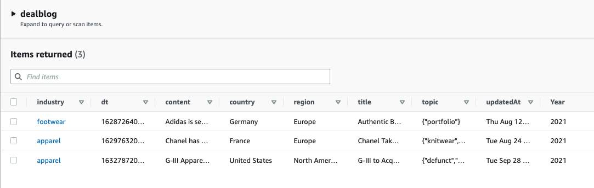

### Summary
Set up a NoSQL database via Amazon DynamoDB. Write data into the database.
##
### Assignment Details
- Set up Amazon DynamoDB. For security reasons, use IAM to assign access roles across AWS services vs using access key.
- Create a  `dealblog` table and determine the `primary key`, which is the only key that can be queried on besides the optional `sort key`.
- Write data into the database using `async`.  

##
### Process
###
**Step 1**: Refine schema design

I decided to trim down the database content so I could spend less time on data entry and more time on coding for the front-end. After reviewing DynamoDB documentation on `partition key` and `primary key`, I decided to use `industry` (single string value) as my `partition key` and a numeric time number `dt` converted from the `updatedAt` day value as the `sort key`.

###


###

Based on the updated schema and `primary key` designation, I created a `dealblog` DynamoDB table. A note to myself that for `dt`, even it's a numeric value, I still need to stringify it for writing into database.

###

```javascript
 this.dt = {}; 
 this.dt.N = new Date(updatedAt).getTime().toString();
```

**Step 2**: Create a class for populating blog entries 

I followed the starter code to create 3 sample blog entries and console.log them to check the output.

**Step 3**: Write blog entries into DynamoDB

I created an `async` callback function referencing previous assignmentss to write all blog entries into the `dealblog` table. The blog entries were successfully written into the database.



### Reflections
###
Thanks to this exercise that prompted me to reflect on my SQL AA meeting project - which I should have used a class to create my tables where I can set up proper data types directly. 
I initially set up `title` as the `primary key` but then I realized it didn't give me the flexiblity of a NoSQL database. A NoSQL database stores data in partitions and by leveraging a `partition key`, I can retrieve multiple items within a partition. If I use `title` as the `primary key`, I can only retrieve one unique item at a time and it requires DynamoDB to search through the entire database.
##  
### References
- [How do I choose the right primary key for a DynamoDB table?](https://aws.amazon.com/premiumsupport/knowledge-center/primary-key-dynamodb-table/)
- [Best Practices for Designing and Using Partition Keys Effectively](https://docs.aws.amazon.com/amazondynamodb/latest/developerguide/bp-partition-key-design.html)
- [Choosing the Right DynamoDB Partition Key](https://aws.amazon.com/blogs/database/choosing-the-right-dynamodb-partition-key/)

