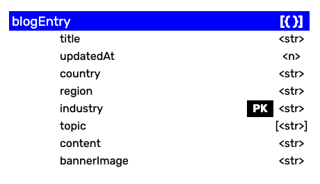

### Summary
Set up a NoSQL database via Amazon DynamoDB. Write data into the database.
##
### Assignment Details
- Set up Amazon DynamoDB. For access security, use IAM assign access roles across AWS services vs using access key.
- Create a  `dealblog` table and determine the `primary key`, which is the only key that can be queried on besides the optional `sorting key`.
- Write data into the database using `async`.  

##
### Process
###
**Step 1**: Refine schema design

I decided to trim down the database content so I could spend less time on data entry and more time on front-end coding. Using the updated schema, I created a `dealblog` DynamoDB table. I chose to use `title` as my `primary key`. I decided not to include a `sorting key`, since it also needs to be queried on. To achieve sorting function, I can build the sorting interactive in the front end instead. 

**Step 2**: Create a class for populating blog entries 

I followed the starter code to create sample blog entries and console.log them to check the output.

**Step 3**: Write blog entries into DynamoDB

I created an `async` callback function referencing previous assignment to write all blog entries into the `dealblog` table. The blog entries were successfully written into the database.

### Reflections
###
Thanks to this exercise that prompted me to reflect on my SQL project - which I should have used a class to create my tables where I can set up proper data types directly. 

