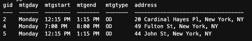
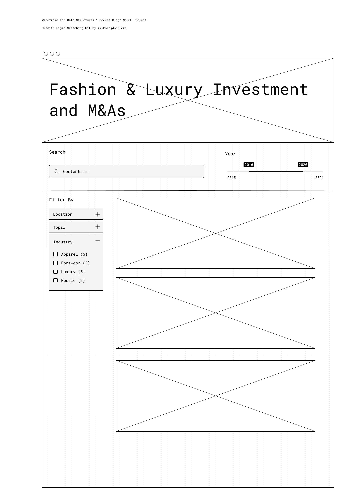
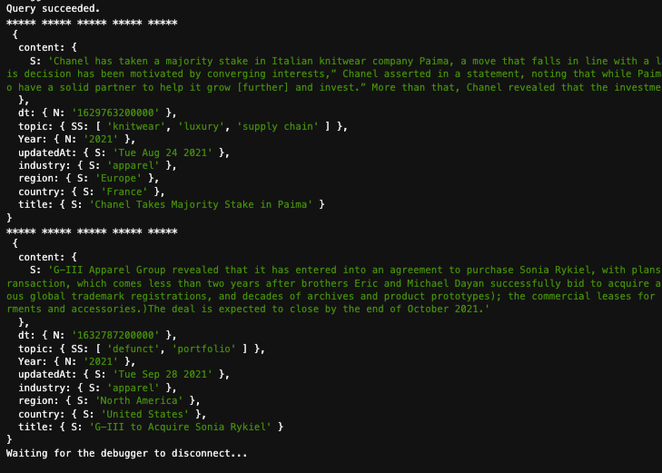

### Summary
Write queries in both PostgreSQL and NoSQL databases and populate results. 
##
### Assignment Details
- Create a rough wireframe to contextualize the `dealblog` objects, hence decide on best `primary key` and refine attributes and data types as needed. 
- Write a SQL query for PostgreSQL and NoSQL query for DynamoDB.


##
### PostgreSQL
###
In [week06_sql.js](https://github.com/meanmodemoda/msdv-data-structures/blob/master/week06/week06_sql.js), I wrote a SQL query that joins `meetings` and `aalocations` tables and only show `Open Discussion` type of meetings on Mondays, and it populates the following results.

```javascript
var thisQuery = "SELECT m.gid, m.mtgday, m.mtgstart, m.mtgend, m.mtgtype, l.address FROM aalocations l LEFT JOIN meetings m ON l.gid = m.gid WHERE m.mtgday = 'Monday' and m.mtgtype = 'OD';";
```
###


### NoSQL DynamoDB 

To get more clarity on data structure, I created a wireframe of the `dealblog` first. Based on the wireframe, I refined my data structure further as updated in [week05.js](https://github.com/meanmodemoda/msdv-data-structures/blob/master/week05_02/week05.js).

###


###

In [week06_nosql.js](https://github.com/meanmodemoda/msdv-data-structures/blob/master/week06/week06_nosql.js), I queried blog entries that are related to the `apparel` industry between two specific dates, and it populates the following results.


```javascript
var params = {
    TableName : "dealblog",
    KeyConditionExpression: "industry = :industryName and dt between :minDate and :maxDate",
    ExpressionAttributeValues: {
        ":industryName": {S:"apparel"},
        ":minDate": {N: new Date("July 11, 2021").valueOf().toString()},
        ":maxDate": {N: new Date("September 28, 2021").valueOf().toString()}
    }
};
```
###


### Reflections
###
I think having more concrete front-end structure in mind will help shape decisions for what information we need (and don't need) and how to write the data into the databases.
