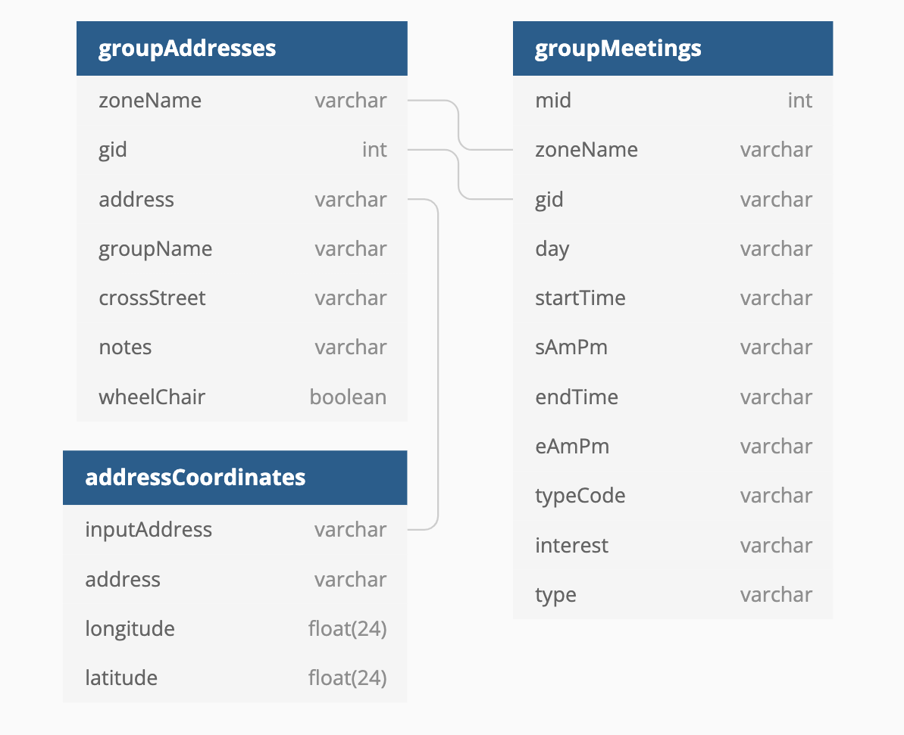
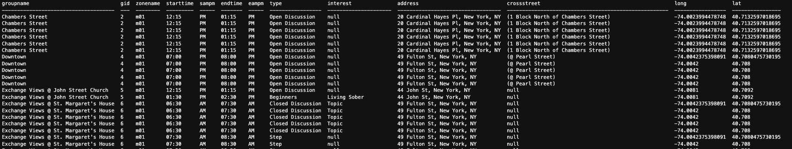

### Summary
Parse and clean AA meeting data for all 10 zones and upload corresponding tables onto SQL database.  
##
### Assignment Details
- Parse and clean all relevant data for zone `m01`. 
- Parse and clean the same data for zones `m02` through `m10` and fetch corresponding geocode data. Identify edge cases for each zone, clean the data programatically to the extent possible and make minor manual edits where applicable.
- Combine data for 10 zones and write them into SQL database.


##
### Process
###
**Step 1**: Update SQL database diagram

Simplify the diagram as below and use it as a roadmap for data parsing and cleaning.


**Step 2**: Parse and clean data 

- In [week07_sql_scrape.js](https://github.com/meanmodemoda/msdv-data-structures/blob/master/week07/week07_sql_scrape.js), Two classes `GroupAddress` and `MeetingEntry` were constructed to prepare for tables `groupAddresses` and `groupMeetings` accordingly. 
- Various `select` and string methods were performed to parse, clean, and manipulate the data and eventually flatten tables. `groupAddresses` table is flattened at `group` level while `groupMeetings` is flattened at `meeting` level.
- The most important element of this step is to preserve the `one to many` relationship between groups and meetings. A `group` can have multiple `meetings` and each `meeting` within the same `group` should share the same `gid`.
- Another note to myself is to add escape backslashes using the following regrex replacement method to all single quotation marks to avoid PostgreSQL error.
```javascript
str.replace(/[\\"']/g, '\\$&').replace(/\u0000/g, '\\0')
```
- I didn't automate a loop for the 10 zones because each zone has its own wonkiness. I did a visual scan for the output of each zone. For edge cases where programatical tweaks are more effective, code is updated accordingly. However, sometimes, it just makes more sense to make a quick change manually and directly to the file.
- Once all 10 zones' data are collected, I combined them together in [week07_sql_combine.js](https://github.com/meanmodemoda/msdv-data-structures/blob/master/week07/week07_sql_combine.js).
- I used the full list of addresses to fetch the full list of geocode in [week07_sql_geocode.js](https://github.com/meanmodemoda/msdv-data-structures/blob/master/week07/week07_sql_geocode.js).
- At each step, check points were put into place (i.e., console.logging array lengths and spot checks) to make sure the data is returned completely without missing records or having duplicates.
- Now everything is ready for writing into SQL.

**Step 3**: Writing into SQL
- Based on the diagram, I created three tables in the SQL database in [week07_create_sqltables.js](https://github.com/meanmodemoda/msdv-data-structures/blob/master/week07/week07_create_sqltables.js).
- Then I used template literals to write data into respective tables in [week07_fill_sqltables.js](https://github.com/meanmodemoda/msdv-data-structures/blob/master/week07/week07_fill_sqltables.js) and checked the final result for each table in [week07_check_sqltables.js](https://github.com/meanmodemoda/msdv-data-structures/blob/master/week07/week07_check_sqltables.js). The row counts of the tables match the lengths of the data arrays. 374 rows for `group` level data and 1206 rows for `meeting` level data are stored. 
- Finally, I joined the three tables in SQL and returned a select query in [week07_sql_querytables.js](https://github.com/meanmodemoda/msdv-data-structures/blob/master/week07/week07_sql_querytables.js).
