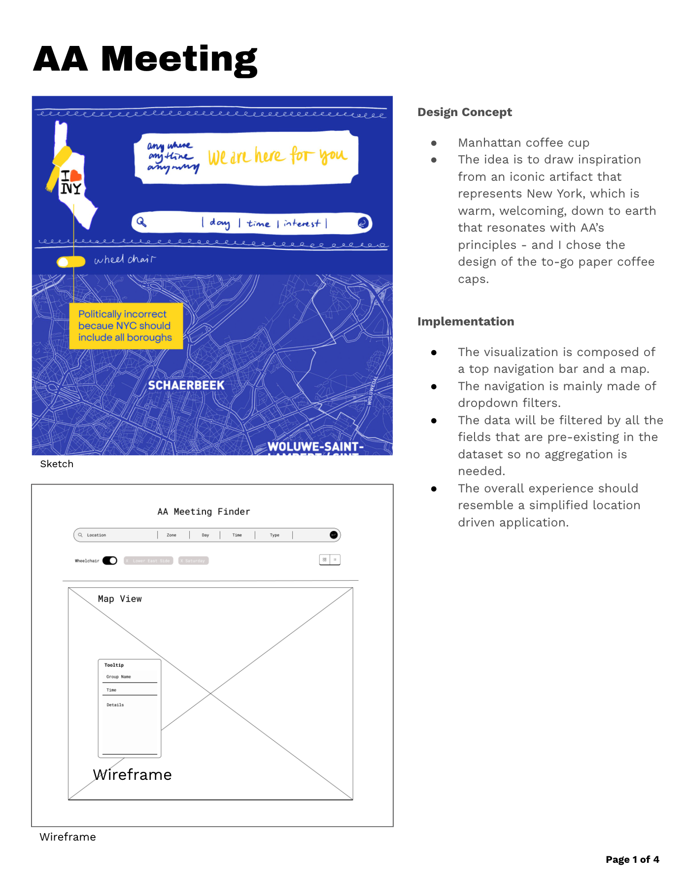
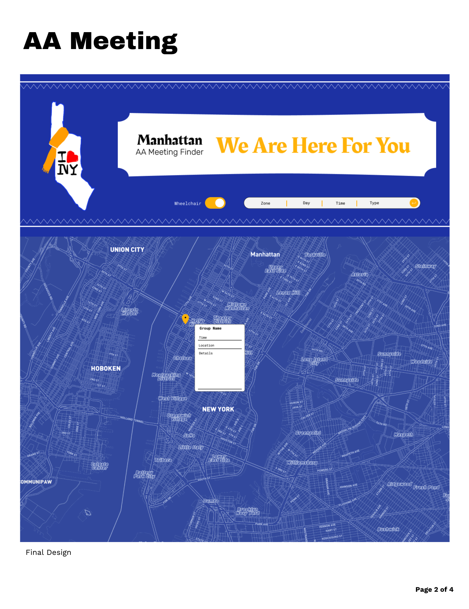
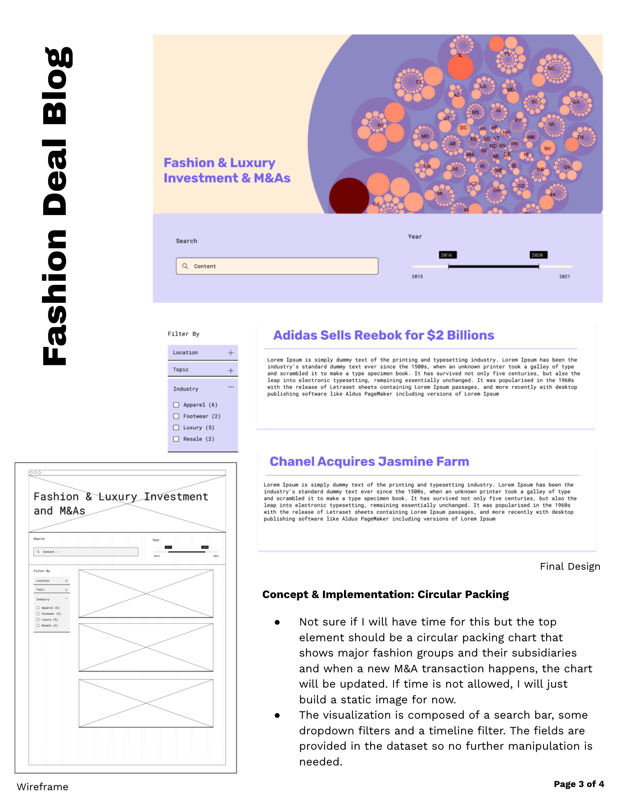
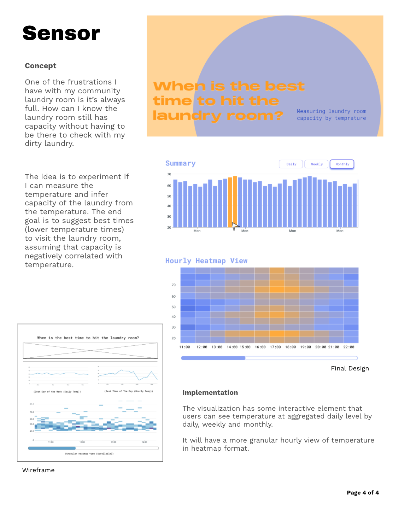

### Summary
Finalize design of three final projects: 1) AA Meeting Finder 2) Fashion Deal Blog. 3) Temperature Sensor. 
See complete [PDF](https://github.com/meanmodemoda/msdv-data-structures/blob/master/week10/Data_Structures_Final_Project_Design.pdf) here or images below.
##
### Assignment Details

### 1) AA Meeting Finder
###

### 2) Fashion Deal Blog
###

### 3) Temperature Sensor
###

