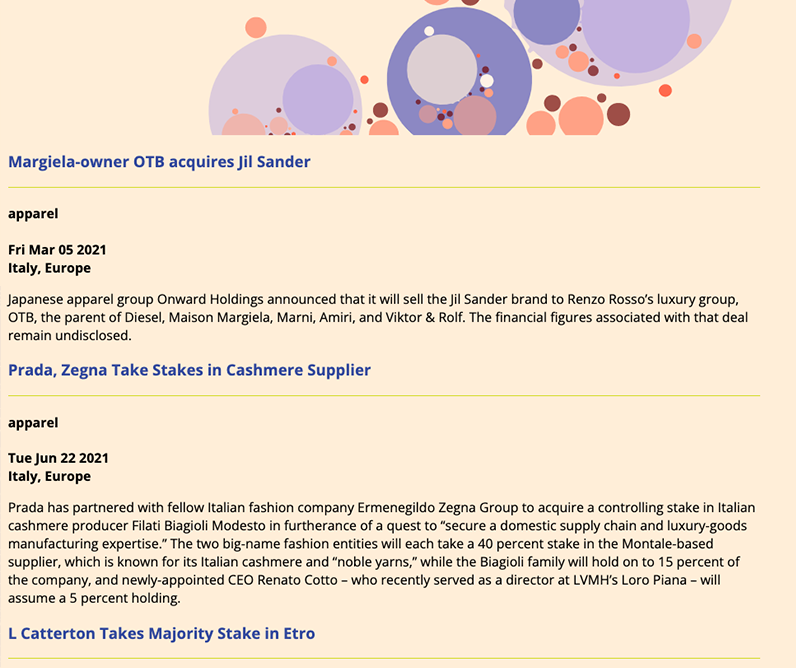

### Summary
Create an application that queries both RDS and NoSQL databases and displays query results on the front end.
##
### Assignment Details
- Install dependencies `express` (request handling), `handlebars`(templating), `moment` (time handling, deprecated), `leaflet` (mapping), `mapbox` (tile style). 
- Leverage `Node.js`,`express` and `handlebars` to create a process of sending query requests to databases and constructing query results into front end content.
- Minimum user input is involved in this project. Run the app in local Cloud 9. 


##
### Process
###
**Step 1**: Use static dummy data to construct and test front end templates. 

I broke down the starter code into sections and constructed the `aa meeting` and `process blog` html docs and tested them in local environment. 

The original test files are saved in [week11_draft_userinput](https://github.com/meanmodemoda/msdv-data-structures/tree/master/week11_draft_userinput) folder.

**Step 2**: Send query requests to RDS and NoSQL databases.

In this part, I followed closely with the starter code. One notable challenge is in the `aa meeting` project, I need to create a template for the Leaflet tooltip. The construct of the SQL query output is a JSON composite array - an array of objects that contains both objects and arrays. Each pair of `long` and `lat` is mapped to an array of meeting info, which means the Leaflet tooltip info is nested below each `long` and `lat` pair.
I decided to create a function to return the nested meeting info result.

Below is the code to add tooltip to Leaflet.
```
for (let i=0; i<data.length; i++) {
    L.marker([data[i].lat, data[i].long]).bindPopup(createTooltip(data[i].meetings)).addTo(mymap);
}
```
The `createTooltip` function returns the nested meeting info for each `lang` and `lat` pair.

```
function createTooltip (meetings) {
    
    let wheelchair;
    let interest;
    let output="";
    
    for (let data of meetings) {
        
        if (data.wheelchair===false) {
         wheelchair = `No wheelchair access`;
     } else {
         wheelchair = `Wheelchair accessible<br><br>`;
    }
    if (data.interest==="null") {
         interest = ` `;
     } else {
         interest= `${data.interest}`;
     }     
         
  output += `<div class="tooltip"><div class="tooltip-header" style="color:#3852A7;"><h3>${data.groupname}</h3></div><div class="divider" style="background-color:#D7DF23;height:0.25px;"></div><br><b>${data.day}</b>
  <b>${data.starttime} ${data.sampm} - ${data.endtime} ${data.eampm}</b>
  <p>${data.type}<br>${data.address}</p><p class="extra">${interest}<br>${wheelchair}</p></div>`
        
    }
    
 return output;
}
```

It's also worth noting that I need to be careful with null value to ensure accurate querying even if it's out of the scope of this project. For instance, if the wheelchair toggle is turned off, it means the user is indifferent about whether the meeting is wheelchair accessible or not so the query should return both wheelchair `true` and `false` values, but if it's toggled on, the query should return `true` value. Toggling off is not the opposite of `true`.


**Step 3**: Packaging HTML into templates
- Once everything was tested, I removed the dummy data and formatted the html files into `handlebars` template txt files.
- I created another simple landing template for the app landing page.
- I ran the app and it functioned as desired. I didn't spend too much time formatting the sites so the front end design is just for illustration purpose.

| AA Meeting Screenshot | Process Blog Screenshot |
| ------------- | ------------- |
|  | |

